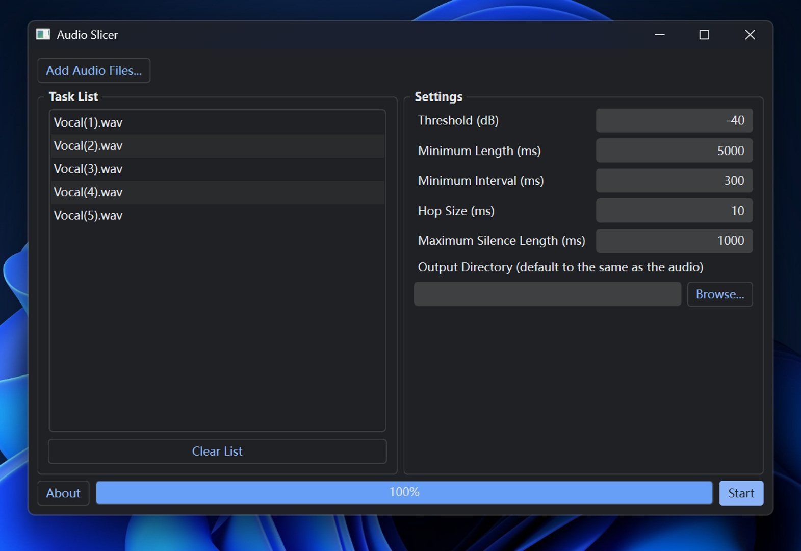

# 音频切片机
一个简约的 GUI 应用程序，通过静音检测对音频进行切片。

## 屏幕截图



应用还有一个浅色主题。

## 用法

### Windows

- 在[这里](https://github.com/flutydeer/audio-slicer/releases)下载并解压最新版本。

- 运行“slicer-gui.exe”。

### MacOS & Linux

- 克隆此仓库。

- 运行以下命令安装环境：

```shell
pip install -r requirements.txt
```

- 运行以下命令启动 GUI：

```Shell
python slicer-gui.py
```

只需点击“Add Audio Files...”按钮来添加音频文件，或将它们拖放到窗口中，单击“Start”按钮并等待任务完成。进度条无法指示单个任务的进度，因此当任务列表中只有1个任务时，它会保持0%直到完成。
## 算法

### 静音检测

本应用根据 RMS（均方根）来测量音频的安静度并检测静音部分，计算每个帧的 RMS 值（帧长度设为 **hop size**（跳跃步长）），RMS 低于 **threshold**（阈值）的所有帧都将被视为静默帧。

### 音频切片

一旦检测到自上次切片以来的有效（声音）部分达到 **min length** （最小长度），且长度超过 **min interval**（最小间距）的静音部分，该音频将从静音区域内 RMS 值最低的帧脱离出来。长时间静音的部分可能会被删除。


## 参数

### Threshold（阈值）

以 dB 表示的 RMS 阈值。所有 RMS 值都低于此阈值的区域将被视为静音。如果音频有噪音，请增加此值。默认值为 -40。

### Minimum Length（最小长度）

每个切片音频剪辑所需的最小长度，以毫秒为单位。默认值为 5000。

### Minimum Interval（最小间距）

要切片的静音部分的最小长度，以毫秒为单位。如果音频仅包含短暂的中断，请将此值设置得更小。此值越小，此应用程序可能生成的切片音频剪辑就越多。请注意，此值必须小于 min length 且大于 hop size。默认值为 300。

### Hop Size（跳跃步长）

每个 RMS 帧的长度，以毫秒为单位。增加此值将提高切片的精度，但会降低处理速度。默认值为 10。

### Maximum Silence Length（最大静音长度）

在切片音频周围保持的最大静音长度，以毫秒为单位。根据需要调整此值。请注意，设置此值并不意味着切片音频中的静音部分具有完全给定的长度。如上所述，该算法将搜索要切片的最佳位置。默认值为 1000。

## 性能

此应用程序在 Intel i7 8750H CPU 上的运行速度超过 400 倍于实时。速度可能因 CPU 和磁盘而异。
